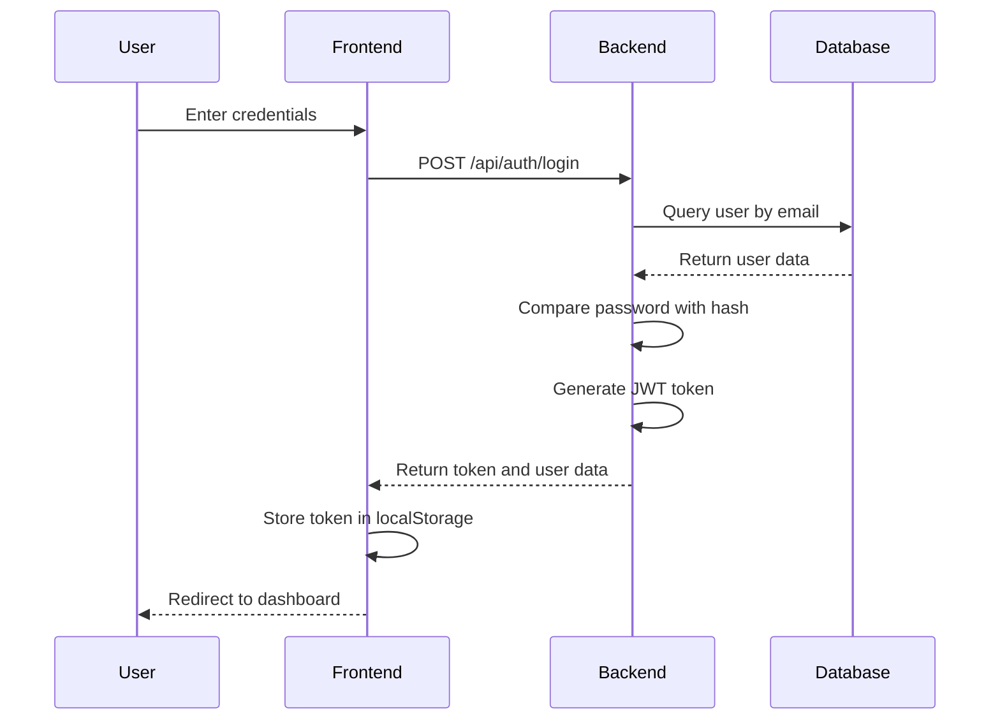
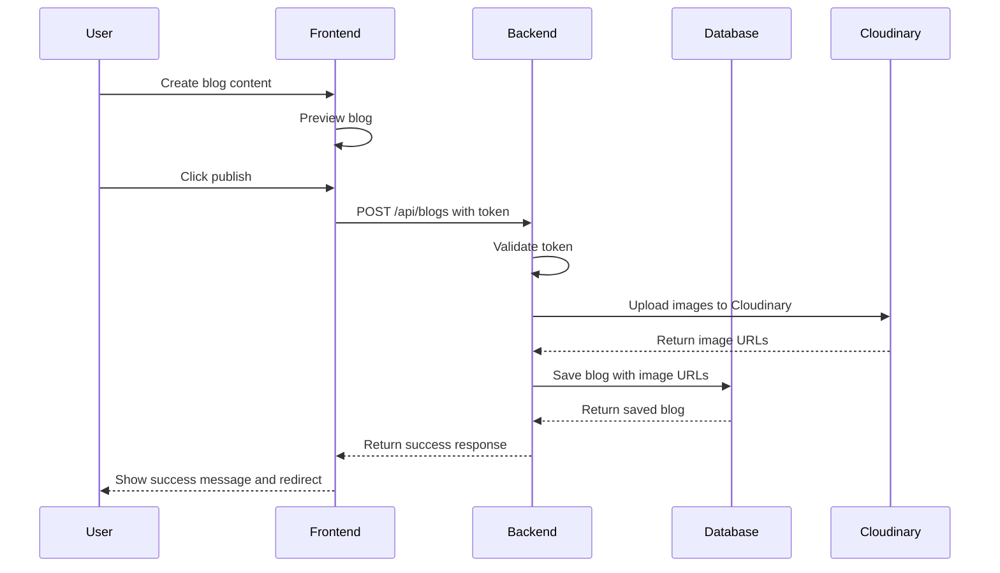
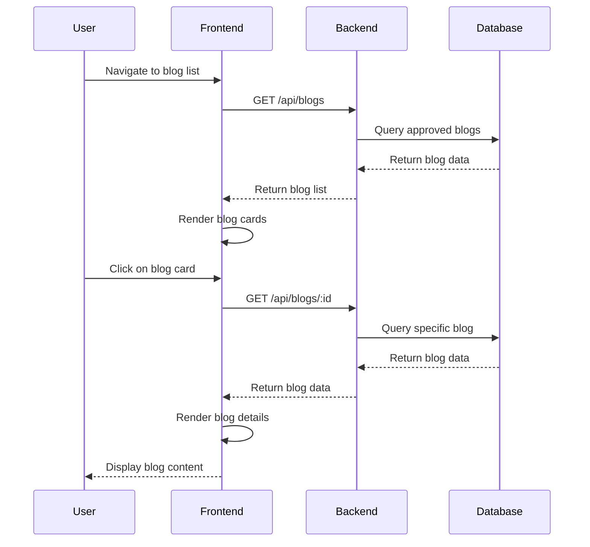
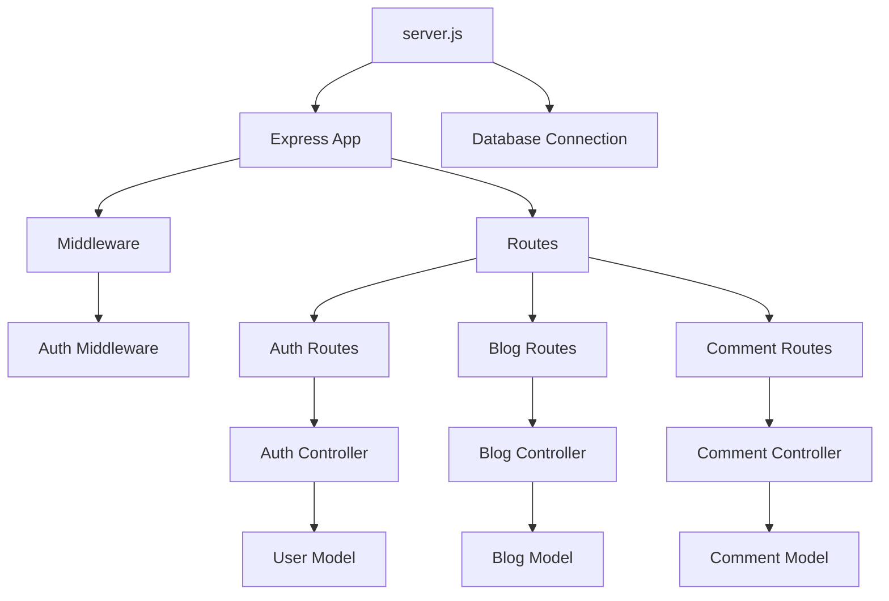
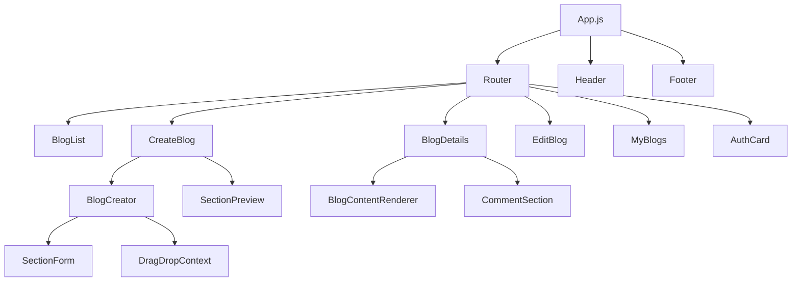
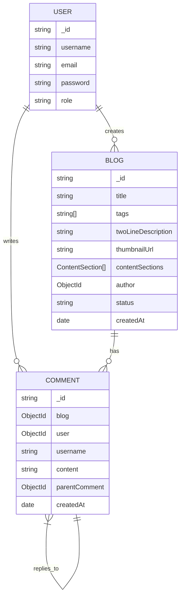

# System Architecture Documentation

## Overview

This document provides a detailed overview of the blog website's system architecture, including the technology stack, data flow, component interactions, and design patterns used throughout the application.

## High-Level Architecture

The blog website follows a client-server architecture with a clear separation of concerns between the frontend and backend:

```
┌─────────────────────────────────────────────────────────────────────┐
│                            Client Layer                             │
├─────────────────────────────────────────────────────────────────────┤
│  ┌─────────────────┐  ┌─────────────────┐  ┌─────────────────────┐  │
│  │   Web Browser   │  │  React Frontend │  │  State Management   │  │
│  │                 │  │                 │  │                     │  │
│  │                 │  │                 │  │                     │  │
│  └─────────────────┘  └─────────────────┘  └─────────────────────┘  │
├─────────────────────────────────────────────────────────────────────┤
│                           API Layer                                 │
├─────────────────────────────────────────────────────────────────────┤
│  ┌─────────────────┐  ┌─────────────────┐  ┌─────────────────────┐  │
│  │   RESTful API   │  │  Express.js     │  │  Authentication     │  │
│  │                 │  │  Middleware     │  │  & Authorization    │  │
│  │                 │  │                 │  │                     │  │
│  └─────────────────┘  └─────────────────┘  └─────────────────────┘  │
├─────────────────────────────────────────────────────────────────────┤
│                         Business Logic Layer                        │
├─────────────────────────────────────────────────────────────────────┤
│  ┌─────────────────┐  ┌─────────────────┐  ┌─────────────────────┐  │
│  │  Controllers    │  │   Services      │  │  Data Validation    │  │
│  │                 │  │                 │  │                     │  │
│  │                 │  │                 │  │                     │  │
│  └─────────────────┘  └─────────────────┘  └─────────────────────┘  │
├─────────────────────────────────────────────────────────────────────┤
│                          Data Layer                                 │
├─────────────────────────────────────────────────────────────────────┤
│  ┌─────────────────┐  ┌─────────────────┐  ┌─────────────────────┐  │
│  │   MongoDB       │  │  Mongoose ODM   │  │  Data Models        │  │
│  │                 │  │                 │  │                     │  │
│  │                 │  │                 │  │                     │  │
│  └─────────────────┘  └─────────────────┘  └─────────────────────┘  │
└─────────────────────────────────────────────────────────────────────┘
```

## Technology Stack

### Backend Technologies

1. **Node.js**: JavaScript runtime environment that executes JavaScript code server-side
2. **Express.js**: Fast, unopinionated, minimalist web framework for Node.js
3. **MongoDB**: Document-oriented NoSQL database
4. **Mongoose**: MongoDB object modeling tool designed to work in an asynchronous environment
5. **JSON Web Tokens (JWT)**: Industry standard RFC 7519 method for representing claims securely between two parties
6. **Bcrypt.js**: Library for hashing passwords
7. **Cors**: Package for providing a Connect/Express middleware that can be used to enable CORS

### Frontend Technologies

1. **React**: JavaScript library for building user interfaces
2. **React Router**: Declarative routing for React applications
3. **React Toastify**: React notification library
4. **React Syntax Highlighter**: Syntax highlighting component for React with PrismJS or Highlight.js
5. **React Star Sky**: Animated star background component
6. **@hello-pangea/dnd**: Drag and drop library for React
7. **Lucide React**: Icon library for React

## Data Flow

### User Authentication Flow



### Blog Creation Flow



### Blog Display Flow



## Component Architecture

### Backend Component Diagram



### Frontend Component Diagram



## Database Design

### Entity Relationship Diagram



### Content Section Schema

The blog content is structured as an array of content sections, each with a type and specific fields:

```javascript
{
  type: {
    type: String,
    enum: ["paragraph", "subtopic", "image", "youtubeEmbed", "bulletList", "codeSnippet"]
  },
  // Fields vary based on type:
  // Paragraph
  text: String,
  
  // Subtopic
  title: String,
  level: Number,
  
  // Image
  url: String,
  caption: String,
  altText: String,
  previewUrl: String,
  
  // YouTube Embed
  videoUrl: String,
  caption: String,
  
  // Bullet List
  items: [String],
  
  // Code Snippet
  language: String,
  code: String
}
```

## Security Considerations

1. **Authentication**: JWT tokens are used for stateless authentication
2. **Authorization**: Role-based access control (RBAC) with user and admin roles
3. **Password Security**: Passwords are hashed using bcrypt before storage
4. **Input Validation**: All user inputs are validated both on frontend and backend
5. **CORS**: Cross-Origin Resource Sharing is properly configured
6. **Environment Variables**: Sensitive data like database credentials and JWT secrets are stored in environment variables

## Scalability Considerations

1. **Database Indexing**: Proper indexing on frequently queried fields (email, blog status, etc.)
2. **Caching**: Potential for implementing caching for frequently accessed data
3. **Load Balancing**: Architecture supports horizontal scaling with load balancers
4. **Microservices**: Can be refactored into microservices if the application grows
5. **CDN**: Images are stored on Cloudinary CDN for better performance

## Deployment Architecture

```
┌─────────────────┐    ┌─────────────────┐    ┌─────────────────┐
│   Load Balancer │    │   Load Balancer │    │   Load Balancer │
│    (Optional)   │    │    (Optional)   │    │    (Optional)   │
└─────────────────┘    └─────────────────┘    └─────────────────┘
         │                       │                       │
┌─────────────────┐    ┌─────────────────┐    ┌─────────────────┐
│   Web Server    │    │   Web Server    │    │   Web Server    │
│   (Node.js)     │    │   (Node.js)     │    │   (Node.js)     │
└─────────────────┘    └─────────────────┘    └─────────────────┘
         │                       │                       │
         └───────────────────────┼───────────────────────┘
                                 │
                    ┌─────────────────────────┐
                    │    MongoDB Cluster      │
                    └─────────────────────────┘
```

## Error Handling

The application implements comprehensive error handling at multiple levels:

1. **Frontend Error Handling**: Try-catch blocks and user-friendly error messages
2. **Backend Error Handling**: Custom error middleware and proper HTTP status codes
3. **Database Error Handling**: Mongoose validation and error handling
4. **Network Error Handling**: Timeout handling and retry mechanisms

## Performance Optimization

1. **Database Indexing**: Proper indexing on frequently queried fields
2. **Image Optimization**: Cloudinary handles image optimization and delivery
3. **Code Splitting**: React's lazy loading for components
4. **Minification**: Production builds are minified
5. **Caching**: Browser caching strategies for static assets

## Monitoring and Logging

1. **Application Logging**: Console logging for debugging and monitoring
2. **Error Tracking**: Centralized error tracking (can be extended with tools like Sentry)
3. **Performance Monitoring**: Response time monitoring (can be extended with tools like New Relic)

This architecture provides a solid foundation for a scalable, maintainable, and secure blog platform that can evolve with changing requirements.