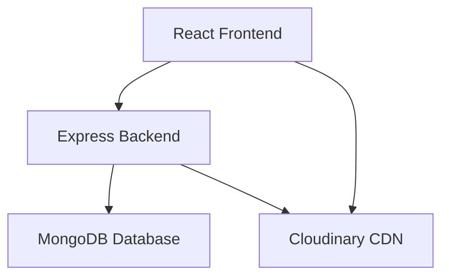
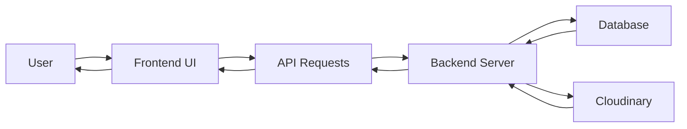
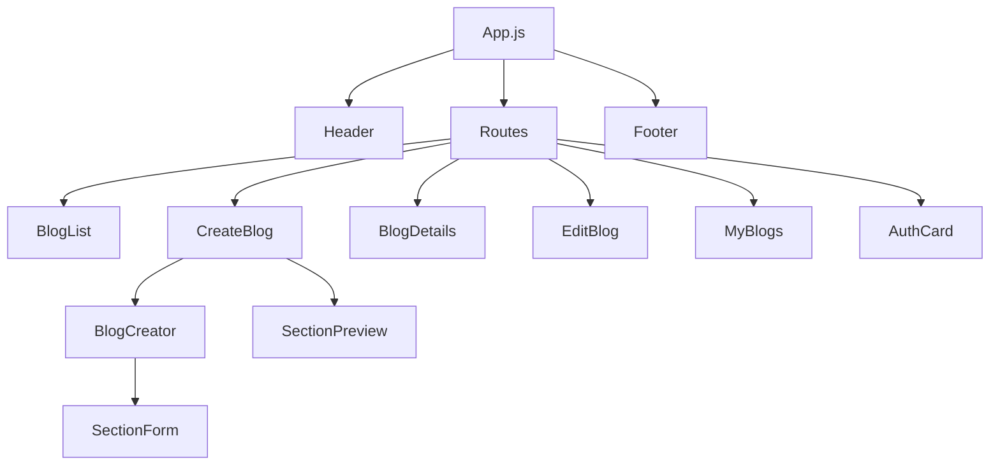

# Blog Website Project Documentation

## Table of Contents
1. [Project Overview](#project-overview)
2. [Architecture](#architecture)
3. [Technology Stack](#technology-stack)
4. [Folder Structure](#folder-structure)
5. [Backend Documentation](#backend-documentation)
6. [Frontend Documentation](#frontend-documentation)
7. [API Endpoints](#api-endpoints)
8. [Database Schema](#database-schema)
9. [Deployment](#deployment)
10. [Diagrams](#diagrams)

## Project Overview

This is a full-stack blog website that allows users to create, read, and manage blog posts with rich content including text, images, YouTube videos, code snippets, and more. The platform features user authentication, blog creation with a drag-and-drop editor, comment functionality, and an admin approval system.

Key features include:
- User registration and authentication
- Rich blog content creation with multiple section types
- Blog post management and editing
- Comment system for reader engagement
- Admin approval workflow for blog posts
- Responsive design with a modern UI

## Architecture

The project follows a client-server architecture with a React frontend and Node.js/Express backend, communicating through RESTful APIs. MongoDB serves as the database with Mongoose as the ODM.

```
┌─────────────────┐    HTTP Requests    ┌──────────────────┐
│   React Frontend│ ──────────────────→ │  Express Backend │
│   (Port 3000)   │ ←────────────────── │   (Port 5000)    │
└─────────────────┘                     └──────────────────┘
                                                  │
                                                  ▼
                                          ┌───────────────┐
                                          │ MongoDB Atlas │
                                          └───────────────┘
```

## Technology Stack

### Backend
- **Node.js** - JavaScript runtime environment
- **Express.js** - Web application framework
- **MongoDB** - NoSQL database
- **Mongoose** - MongoDB object modeling tool
- **JWT** - JSON Web Tokens for authentication
- **Bcrypt.js** - Password hashing
- **Cors** - Cross-Origin Resource Sharing

### Frontend
- **React** - JavaScript library for building user interfaces
- **React Router** - Declarative routing for React
- **React Toastify** - Notification library
- **React Syntax Highlighter** - Code syntax highlighting
- **React Star Sky** - Animated star background
- **@hello-pangea/dnd** - Drag and drop library
- **Lucide React** - Icon library

## Folder Structure

```
BLOG_website/
├── backend/
│   ├── src/
│   │   ├── config/
│   │   │   └── db.js
│   │   ├── controllers/
│   │   │   ├── authController.js
│   │   │   ├── blogController.js
│   │   │   └── commentController.js
│   │   ├── middleware/
│   │   │   └── authMiddleware.js
│   │   ├── models/
│   │   │   ├── Blog.js
│   │   │   ├── Comment.js
│   │   │   └── User.js
│   │   ├── routes/
│   │   │   ├── authRoutes.js
│   │   │   ├── blogRoutes.js
│   │   │   └── commentRoutes.js
│   │   └── server.js
│   ├── .env
│   ├── package.json
│   └── package-lock.json
└── frontend/
    ├── public/
    │   ├── index.html
    │   ├── manifest.json
    │   └── robots.txt
    ├── src/
    │   ├── Styles/
    │   │   ├── AuthCard.css
    │   │   ├── BlogCreator.css
    │   │   ├── BlogList.css
    │   │   ├── CreateBlog.css
    │   │   ├── Footer.css
    │   │   ├── Header.css
    │   │   ├── MyBlogs.css
    │   │   └── SectionForm.css
    │   ├── components/
    │   │   ├── AuthCard.jsx
    │   │   ├── BlogCreator.jsx
    │   │   ├── Footer.jsx
    │   │   ├── Header.jsx
    │   │   ├── SectionForm.jsx
    │   │   └── SectionPreview.jsx
    │   ├── pages/
    │   │   ├── BlogDetails.jsx
    │   │   ├── BlogList.jsx
    │   │   ├── CreateBlog.jsx
    │   │   ├── EditBlog.jsx
    │   │   └── MyBlogs.jsx
    │   ├── App.css
    │   ├── App.js
    │   ├── index.css
    │   └── index.js
    ├── .env
    ├── package.json
    └── package-lock.json
```

## Backend Documentation

### Server (server.js)
The main entry point for the backend application that initializes Express, connects to the database, and sets up middleware and routes.

### Configuration (config/db.js)
Handles MongoDB connection using Mongoose with environment variables.

### Models

#### User Model (models/User.js)
Defines the user schema with fields for username, email, password, and role.

#### Blog Model (models/Blog.js)
Defines the blog schema with fields for title, tags, description, content sections, author reference, and status.

Content sections support multiple types:
- Paragraph
- Subtopic (with heading levels)
- Image (with URL, caption, alt text)
- YouTube Embed
- Bullet List
- Code Snippet (with language specification)

#### Comment Model (models/Comment.js)
Defines the comment schema with references to blog and user, content, and support for nested replies.

### Controllers

#### Auth Controller (controllers/authController.js)
Handles user registration and login with password hashing and JWT token generation.

#### Blog Controller (controllers/blogController.js)
Manages blog operations including:
- Creating new blogs
- Retrieving all approved blogs
- Getting blogs by ID
- Editing existing blogs
- Admin approval of pending blogs
- Fetching user-specific blogs

#### Comment Controller (controllers/commentController.js)
Handles comment operations including posting new comments and retrieving comments for specific blogs.

### Middleware

#### Auth Middleware (middleware/authMiddleware.js)
Provides authentication protection with JWT verification and role-based access control.

### Routes

#### Auth Routes (routes/authRoutes.js)
- `POST /api/auth/register` - Register a new user
- `POST /api/auth/login` - Login existing user

#### Blog Routes (routes/blogRoutes.js)
- `GET /api/blogs` - Get all approved blogs
- `POST /api/blogs` - Create a new blog (protected)
- `GET /api/blogs/myblogs` - Get current user's blogs (protected)
- `GET /api/blogs/admin/pending` - Get pending blogs (admin only)
- `PATCH /api/blogs/admin/:id/verify` - Approve a blog (admin only)
- `PUT /api/blogs/:id` - Edit a blog (protected)
- `GET /api/blogs/:id` - Get a specific blog

#### Comment Routes (routes/commentRoutes.js)
- `POST /api/comments/:blogId` - Add a comment to a blog
- `GET /api/comments/:blogId` - Get comments for a blog

## Frontend Documentation

### Main App (App.js)
The main application component that sets up routing and includes global components like Header, Footer, and Toast notifications.

### Components

#### Header (components/Header.jsx)
Navigation bar with links to main pages and user authentication status.

#### Footer (components/Footer.jsx)
Footer component with copyright and additional information.

#### AuthCard (components/AuthCard.jsx)
Authentication component for user login and registration.

#### BlogCreator (components/BlogCreator.jsx)
Main blog creation component with metadata inputs, thumbnail handling, and dynamic section management with drag-and-drop functionality.

#### SectionForm (components/SectionForm.jsx)
Form component for editing different types of content sections.

#### SectionPreview (components/SectionPreview.jsx)
Preview component for viewing blog content before publishing.

### Pages

#### BlogList (pages/BlogList.jsx)
Homepage displaying all approved blog posts in a card layout.

#### BlogDetails (pages/BlogDetails.jsx)
Detailed view of a specific blog post with content rendering and comment functionality.

#### CreateBlog (pages/CreateBlog.jsx)
Page for creating new blog posts with editor and preview modes.

#### EditBlog (pages/EditBlog.jsx)
Page for editing existing blog posts.

#### MyBlogs (pages/MyBlogs.jsx)
Page displaying blogs created by the current user.

### Styles
CSS files for styling components and pages with a dark theme and modern design.

## API Endpoints

### Authentication
| Method | Endpoint | Description | Authentication |
|--------|----------|-------------|----------------|
| POST | /api/auth/register | Register a new user | None |
| POST | /api/auth/login | Login existing user | None |

### Blogs
| Method | Endpoint | Description | Authentication |
|--------|----------|-------------|----------------|
| GET | /api/blogs | Get all approved blogs | None |
| POST | /api/blogs | Create a new blog | Required |
| GET | /api/blogs/myblogs | Get current user's blogs | Required |
| GET | /api/blogs/admin/pending | Get pending blogs | Admin Only |
| PATCH | /api/blogs/admin/:id/verify | Approve a blog | Admin Only |
| PUT | /api/blogs/:id | Edit a blog | Required |
| GET | /api/blogs/:id | Get a specific blog | None |

### Comments
| Method | Endpoint | Description | Authentication |
|--------|----------|-------------|----------------|
| POST | /api/comments/:blogId | Add a comment to a blog | None |
| GET | /api/comments/:blogId | Get comments for a blog | None |

## Database Schema

### User Schema
```javascript
{
  username: String,
  email: { type: String, unique: true },
  password: String,
  role: { type: String, default: "user" }
}
```

### Blog Schema
```javascript
{
  title: { type: String, required: true },
  tags: [String],
  twoLineDescription: { type: String },
  thumbnailUrl: { type: String },
  contentSections: [{
    type: {
      type: String,
      enum: ["paragraph", "subtopic", "image", "youtubeEmbed", "bulletList", "codeSnippet"]
    },
    text: String, // for paragraph
    title: String, // for subtopic
    level: Number, // for subtopic
    url: String, // for image
    caption: String, // for image / youtube
    altText: String, // for image
    previewUrl: String, // for image
    videoUrl: String, // for youtubeEmbed
    items: [String], // for bulletList
    language: String, // for codeSnippet
    code: String // for codeSnippet
  }],
  author: { type: mongoose.Schema.Types.ObjectId, ref: "User" },
  status: { type: String, enum: ["PENDING", "APPROVED"], default: "PENDING" },
  createdAt: { type: Date, default: Date.now }
}
```

### Comment Schema
```javascript
{
  blog: { type: mongoose.Schema.Types.ObjectId, ref: "Blog", required: true },
  user: { type: mongoose.Schema.Types.ObjectId, ref: "User" },
  username: { type: String, required: true },
  content: { type: String, required: true },
  parentComment: { type: mongoose.Schema.Types.ObjectId, ref: "Comment", default: null },
  createdAt: { type: Date, default: Date.now }
}
```

## Deployment

### Backend Deployment
1. Set environment variables in `.env`:
   - MONGO_URI: MongoDB connection string
   - JWT_SECRET: Secret for JWT token signing
   - PORT: Server port (default 5000)

2. Install dependencies:
   ```bash
   npm install
   ```

3. Start the server:
   ```bash
   npm start
   ```
   or for development with auto-reload:
   ```bash
   npm run dev
   ```

### Frontend Deployment
1. Set environment variables in `.env`:
   - REACT_APP_CLOUDINARY_URL: Cloudinary upload URL
   - REACT_APP_BLOG_UPLOAD_PRESET: Cloudinary unsigned upload preset

2. Install dependencies:
   ```bash
   npm install
   ```

3. Start the development server:
   ```bash
   npm start
   ```

4. Build for production:
   ```bash
   npm run build
   ```

## Diagrams

### System Architecture Diagram


### Data Flow Diagram


### Component Structure Diagram


This documentation provides a comprehensive overview of the blog website project, covering its architecture, components, functionality, and deployment instructions.