# System Diagrams

This document contains various diagrams that illustrate the architecture, data flow, and component relationships of the blog website application.

## 1. System Architecture Diagram

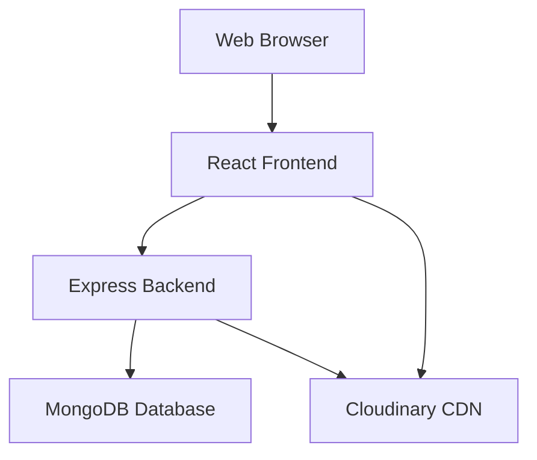

## 2. Backend Component Architecture

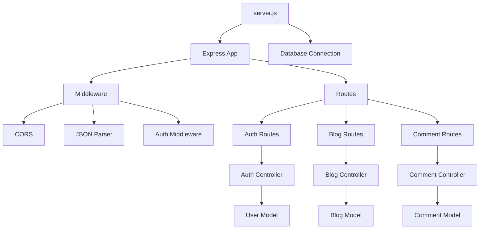

## 3. Frontend Component Architecture

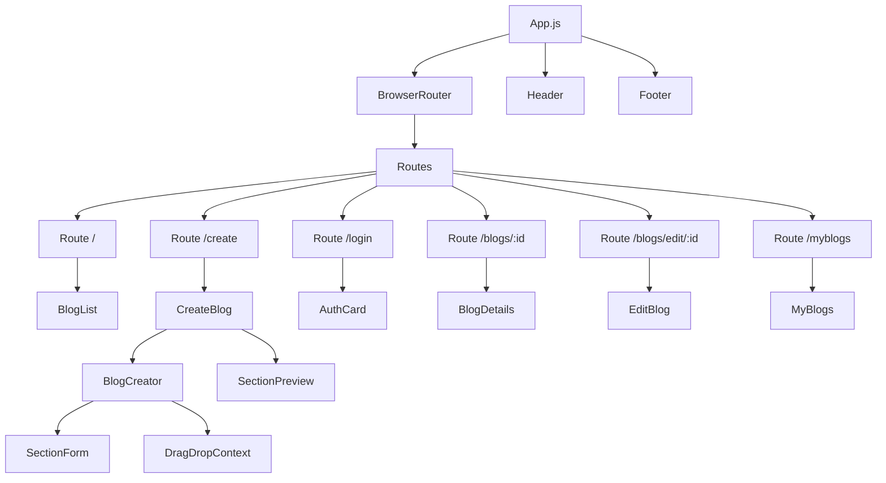

## 4. Database Schema Relationships

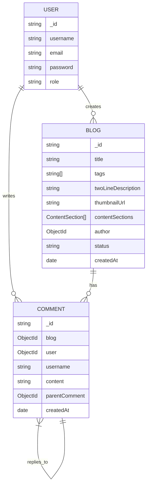

## 5. User Authentication Flow

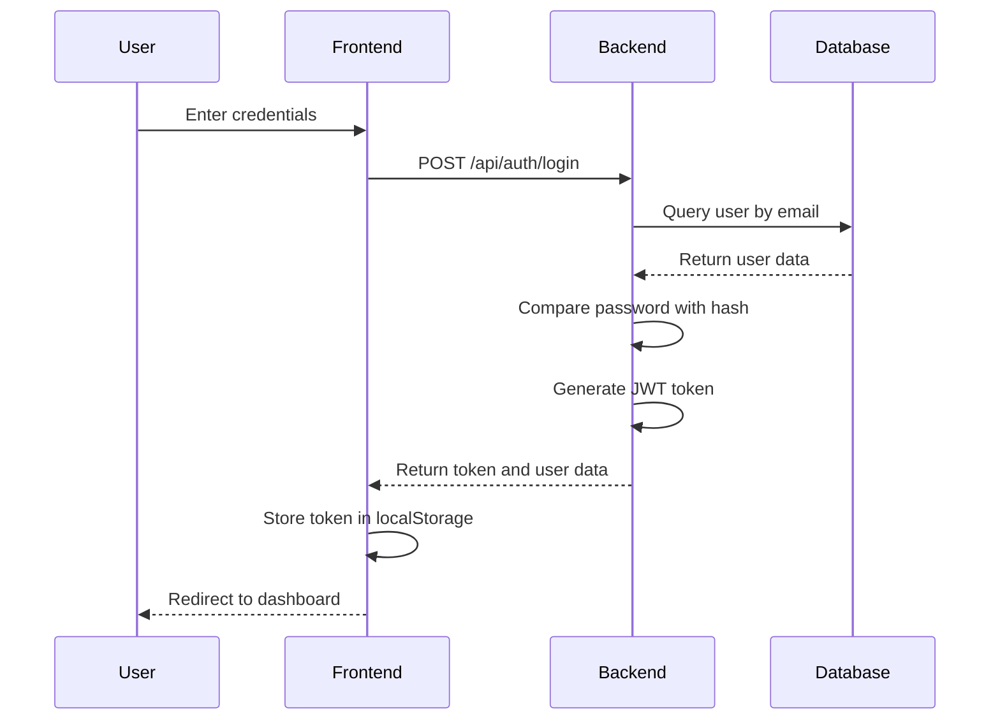

## 6. Blog Creation Flow

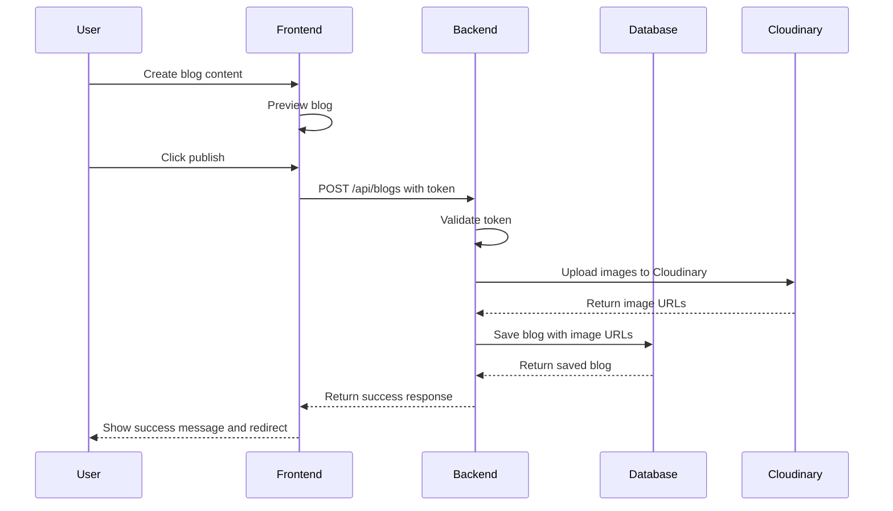

## 7. Blog Display Flow

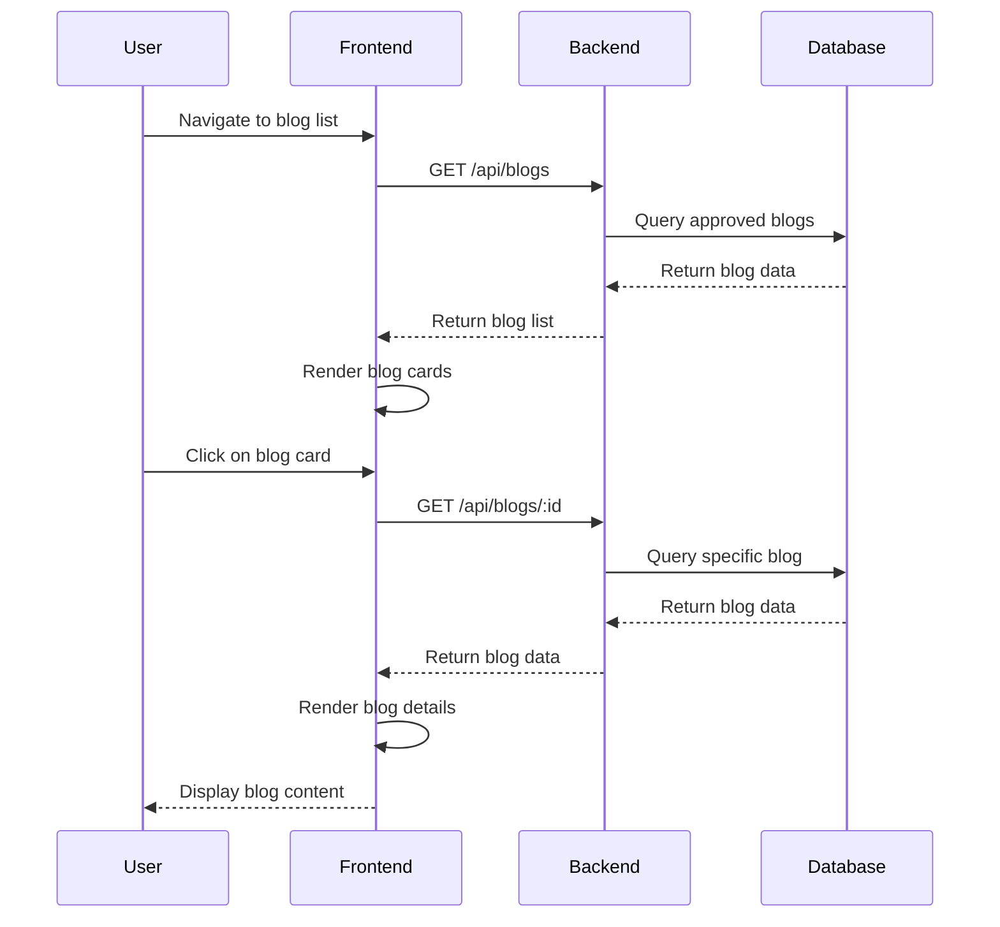

## 8. Comment System Flow

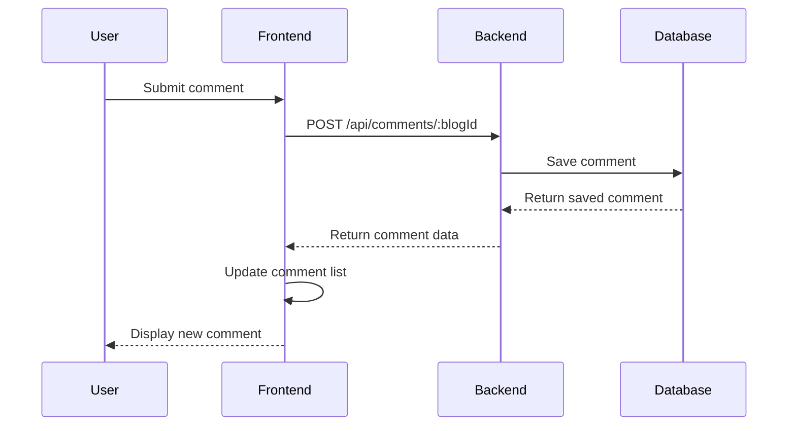

## 9. Data Flow in Blog Creator

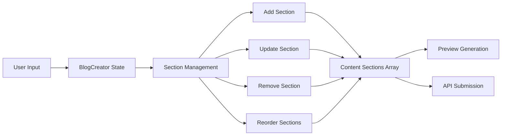

## 10. Deployment Architecture

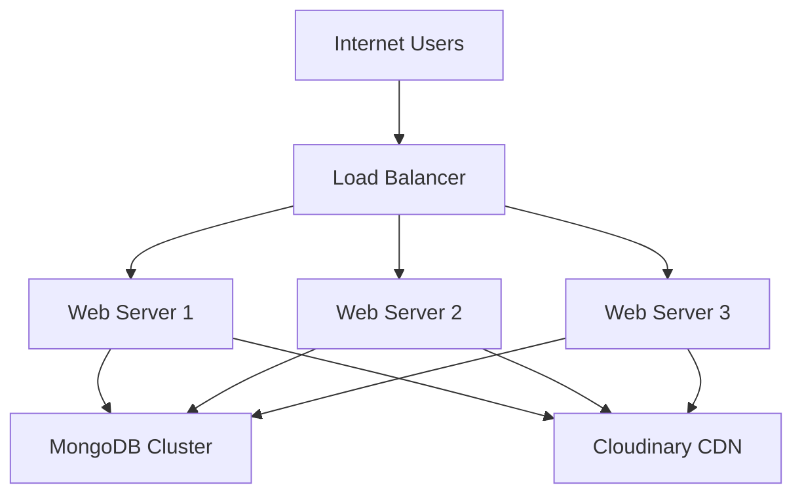

## 11. Folder Structure Visualization

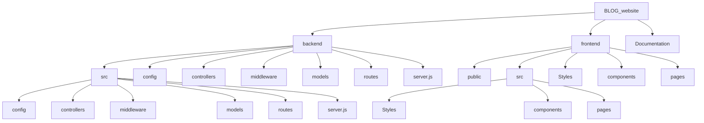

## 12. API Endpoint Structure

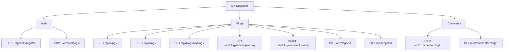

These diagrams provide a visual representation of the blog website's architecture, data flows, and component relationships, helping to understand how different parts of the system interact with each other.